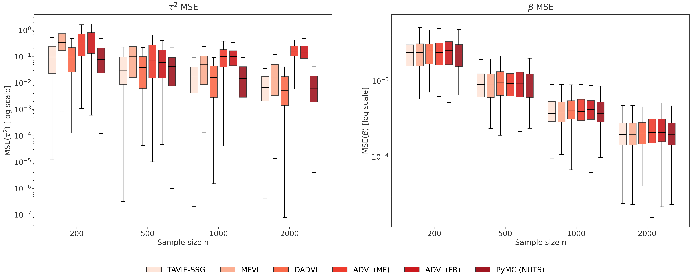
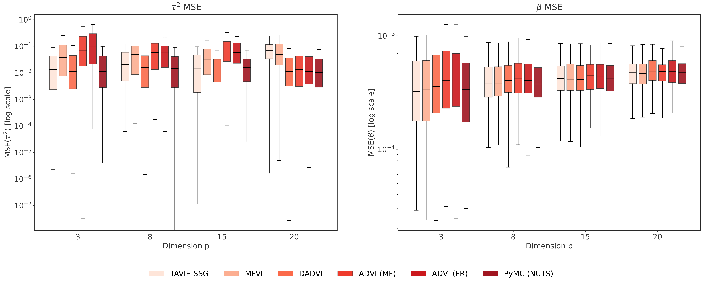
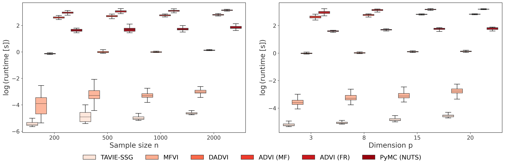
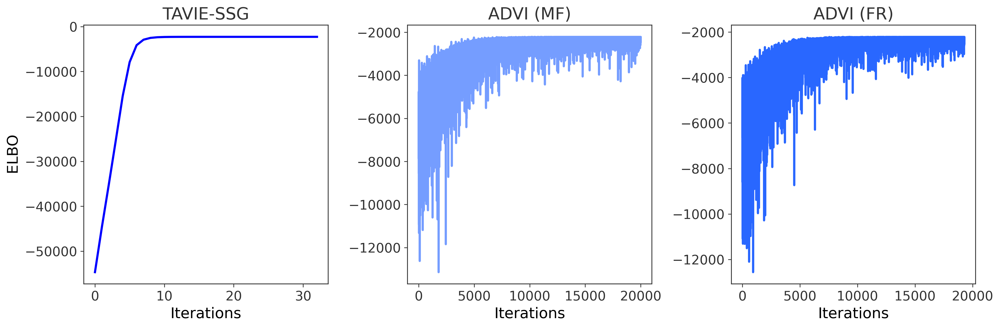
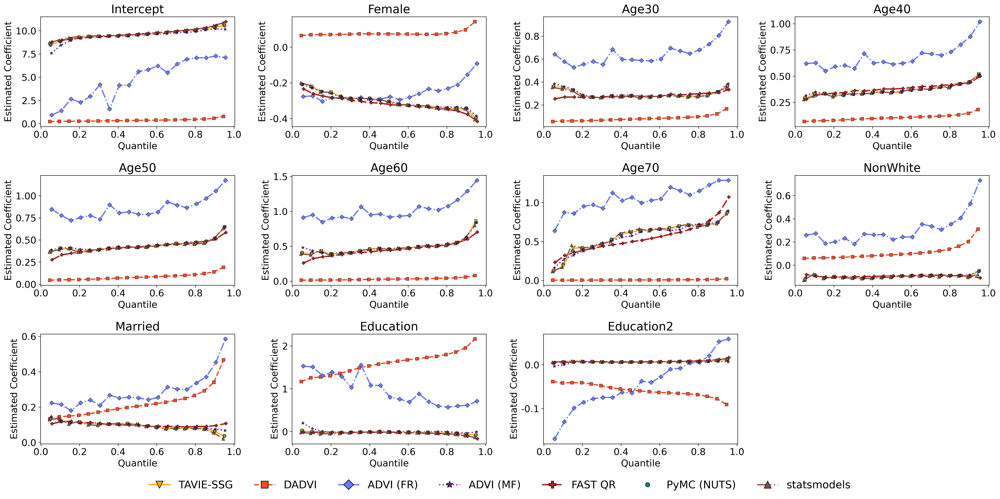
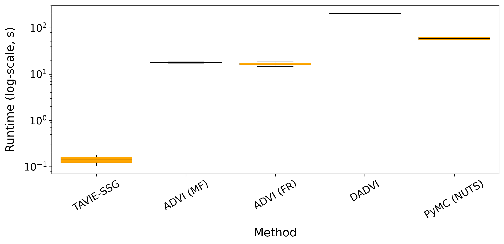
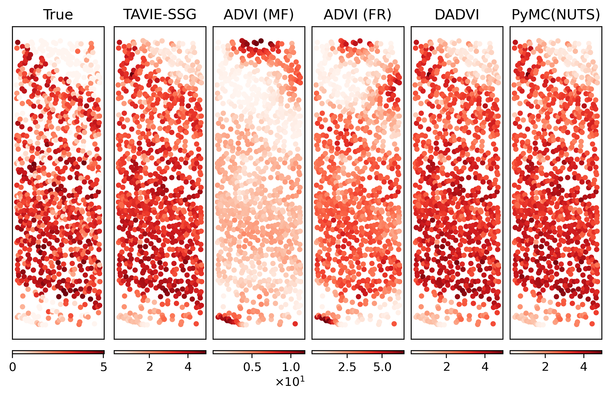
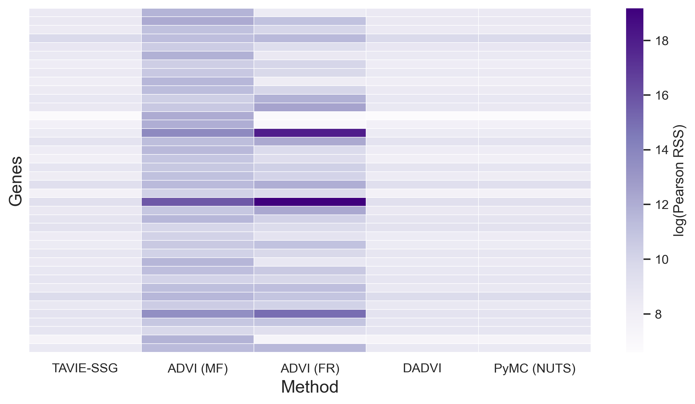

# TAVIE-SSG: A Generalized Tangent Approximation Based Variational Inference Framework for Strongly Super-Gaussian Likelihoods

<p align="center">
  
</p>

This repository holds the source code and implementation of **TAVIE-SSG** proposed in *A Generalized Tangent Approximation Based Variational Inference Framework for Strongly Super‑Gaussian Likelihoods*.

---

## Overview

<p align="center">
  
  <br><em>Tangent minorizers for Student's-t likelihood, animated over 50 values of the variational parameter ξ</em>
</p>

TAVIE-SSG works for a broad class of SSG likelihoods, comprising mainly of the following types of families:
- **Type I families**: These comprise of linear regression models with heavy-tailed error distributions. Notable families of error distributions which can be addressed by TAVIE-SSG include the *Laplace* (*Double-Exponential*) and *Student's-t*. In general, any *scaled-mixture* of *zero-mean Gaussian* distributions have the SSG form, and thus can be implemented using TAVIE-SSG.
- **Type II families**: These comprise of count response models with *Binomial* (including Bernoulli/Logistic) and *Negative-Binomial* distributions.
- **Bayesian quantlile regression**: As an extension of the Type-I likelihood to the *asymmetric Laplace distribution*.

Furthermore, we showcase the implementation and application of TAVIE-SSG in two real-world data studies: (i) *Bayesian quantile regression* in U.S. 2000 Census data, and (ii) *Negative-Binomial* regression to predict *gene expressions* across different spatial locations in the STARmap data.

---

## Installation and Dependencies

To get started with TAVIE-SSG, which is built on `Python==3.13.5`, install the required dependencies:

* `ipython`
* `matplotlib`
* `numpy`
* `pandas`
* `rich`
* `scikit_learn`
* `scipy`
* `torch`
* `tqdm`
* `toolz`
* `pymc`
* `pytensor`

```bash
# moving to the TAVIE directory after cloning the Github repository
cd TAVIE

# install the required dependencies
pip install -r requirements.txt
```
---

## Functionalities of the TAVIE class

The `TAVIE` package wrapped in the 'TAVIE' folder deals with the implementation of the corresponding tangent transformation variational inference algorithm under various SSG probability models. It provides flexible, modular support across different likelihood families and modeling tasks.


| Class             | Target SSG Model               | Supported Likelihoods                               | Prior Type                  |
|-------------------|--------------------------------|-----------------------------------------------------|-----------------------------|
| `TAVIE_loc_scale` | Heavy-tailed location-scale family (Type I SSG) | Laplace, Student’s-t, Custom location-scale         | Gaussian × Gamma    |
| `TAVIE_type_II`    | Count GLMs (Type II SSG)     | Binomial, Negative-Binomial                         | Gaussian                    |
| `TAVIE_QR`         | Quantile Regression           | Asymmetric Laplace distribution            | Gaussian                    |


For importing all these aforementioned classes and initializing them:

```python
# importing all the TAVIE classes
from TAVIE import *

# initializing the TAVIE-SSG location-scale, TAVIE_QR, and TAVIE_type_II models respectively

## following is the location-scale example for 'laplace', other options are 'student' and 'loc_scale' (for general location-scale family)
loc_scale_model = TAVIE_loc_scale(fit_intercept=True, scale_X=False, scale_y=False, family="laplace", afunc=None, cfunc=None)

## following is the example for initializing the quantile regression TAVIE-SSG model
qr_model = TAVIE(fit_intercept=True, scale_X=False, scale_y=False)

## following is the Type II SSG example for 'negbin' (Megative-Binomial regression), the other option is 'binomial' for Logistic regression
type_II_model = TAVIE_type_II(fit_intercept=True, scale_X=False, family="negbin")
```

**Note**: When initializing the *TAVIE location-scale model* under **custom** location-scale error distribution family, the user is required to pass callable functions `afunc` and `cfunc` to the `TAVIE_loc_scale()` class, as discussed in the subsequent section.

---

### Callable functions `afunc` and `cfunc` in `TAVIE_loc_scale()` for custom location-scale family

The *callable* functions `afunc` and `cfunc` are defined in terms of the probability density function (PDF) of the location-scale error distribution family. In other words, when performing the regression $y_i = \boldsymbol{X}_i^{\top}\boldsymbol{\beta} + \epsilon_i$, where $\tau\epsilon_i$ has the PDF $p(x)$, the functions $A(x)$ and $c(x)$ are defined as:

$$
A(x) = -\frac{p'(x)}{2x\cdot p(x)} =(2x)^{-1}\cdot \frac{d}{dx}\log p(x),
$$

$$
c(x) = \log p(x)  - \frac{x\cdot p'(x)}{2\cdot p(x)} = \log p(x) - \frac{x}{2}\cdot \frac{d}{dx}\log p(x),
$$

where $p'(x) = \frac{d}{dx} p(x)$. In particular, when calling `TAVIE_loc_scale()` class for `family="laplace"` and `family="student"`, the computation of the callable functions `afunc` and `cfunc` are performed in-built.

---

### Components of each TAVIE class

For each of the `TAVIE`class listed above, following are the components and their respective functionalities.


| Method Name                   | `TAVIE_loc_scale` | `TAVIE_type_II` | `TAVIE_QR` | Description                                                                 |
|-------------------------------|:-------------------:|:-----------------:|:------------:|-----------------------------------------------------------------------------|
| `fit()`                       | ✅                | ✅               | ✅         | Fits the TAVIE model                                            |
| `get_TAVIE_means()`           | ✅                | ✅               | ✅         | Returns (and optionally displays) the TAVIE posterior means of parameters   |
| `get_variational_estimates()` | ✅                | ✅               | ✅         | Returns a dictionary of variational estimates of the hyper-parameters           |
| `get_elbo()`                  | ✅                | ✅               | ✅         | Returns ELBO values tracked across iterations                               |

✅ = Supported. We give example usage of each of these above listed functions below for various SSG likelihoods considered in TAVIE-SSG.

---

## TAVIE-SSG in action for SSG Type I family: Student's-t likelihood

We consider showing the utilities of each components in the `TAVIE_loc_scale()` class, particularly for the SSG Type I family having the *Student's-t* likelihood of the form:

**Student's-t error model**: $y_i = \beta_0 + \boldsymbol{X}_i^\top \boldsymbol{\beta} + \epsilon_i$, where $y_i \sim t_{\nu}(\boldsymbol{X}_i^\top \boldsymbol{\beta} , \tau)$, for $i=1,2,\ldots,n$ with $f(y_i \mid \boldsymbol{X_i}, \boldsymbol{\beta}, \tau, \nu) \propto \tau \left(1 + \frac{\tau^2(y_i - \mathbf{x}_i^{\top}\boldsymbol{\beta})^{2}}{\nu}\right)^{-\frac{\nu + 1}{2}}$.

**Prior**: $(\boldsymbol{\beta}, \tau^2)$ is endowed upon with a prior as, $\boldsymbol{\beta}\mid \tau^2 \sim N(\boldsymbol{m}, \boldsymbol{V}/\tau^2)$ and $\tau^2\sim Gamma(a/2, b/2)$.

We first generate the data from the Student's-t model with parameters:
* $(n, p, \tau^2_{\text{true}}, \nu) = (10000, 8, 8, 5)$,
* The design matrix $X\in \mathbb{R}^{p+1}$ comprise of entries from the *standard normal distribution* with the first column being $1_n$ automatically added by the `TAVIE_loc_scale()` class on choosing `fit_intercept=True`,
* $\boldsymbol{\beta}_{\text{true}} = (\beta_0, \beta)\in \mathbb{R}^{p+1}$ is also generated from the *standard normal distribution*.

```python
# Simulated data
n = 10000
p = 8
tau2 = 8
nu = 8

# Design matrix, true regression coefficients and response
X = np.random.normal(size=(n, p))
beta_true = np.random.normal(loc=0.0, scale=1.0, size=p+1)
error = np.random.standard_t(size=n, df=nu)* (1 / np.sqrt(tau2))
y = beta_true[0] + X @ beta_true[1:len(beta_true)] + error
```

Consequently, we initialize the TAVIE-SSG model and *fit* the initialized model using `fit()` for this particular Student's-t likelihood:

```python
# Initialize the TAVIE model for Student's-t likelihood
student_model = TAVIE_loc_scale(family="student", fit_intercept=True) # choosing an intercept term
student_model.fit(X, y, nu = nu, verbose=True) # fit the TAVIE-SSG model
```

Now that the TAVIE model has been fit, we obtain the resultant *estimated TAVIE means* of $\beta_{\text{true}}$ and $\tau_{\text{true}}$ using the `get_TAVIE_means()` functionality along with printing them on the console using the `verbose=True` argument:

```python
student_model.get_TAVIE_means(verbose=True) # get the TAVIE estimates
```

If the user is interested to obtain the *variational estimates* of the hyper-parameters ($\boldsymbol{m}$, $\boldsymbol{V}$, $a$, $b$), it can be done using `get_variational_estimates()`:

```python
# obtain the variational parameter estimates; use 'variational_est' as required
variational_est = student_model.get_variational_estimates()
```

To check the convergence diagnostics, we also have the `get_elbo()` functionality that could be used to obtain the *evidence lower bound* (ELBO) history over iterations:

```python
ELBO = student_model.get_elbo() # get the ELBO across iterations
```

**Note**: TAVIE-SSG applied to other SSG likelihoods along with the utilities of each component in the different `TAVIE` classes have been illustrated in [TAVIE_examples.ipynb](./TAVIE_examples.ipynb).

---

## TAVIE-SSG vs other state-of-the-art competing algorithms

We present a bake-off of TAVIE-SSG against competing variational inference and MC sampling algorithms viz.,
* `ADVI (MF)`: Automatic Differentiation Variational Inference ([Kucukelbir et al., 2017](https://jmlr.org/papers/v18/16-107.html)) in mean-field setting;
* `ADVI (FR)`: ADVI in full-rank setting;
* `DADVI`: Deterministic second-order ADVI ([Giordano et al., 2024](https://jmlr.org/papers/v25/23-1015.html));
* `MFVI`: Mean-Field Variational Inference ([Wand et al., 2011](https://matt-p-wand.net/publicns/Wand11.pdf)) (for Student's-t SSG likelihood only); and
* `NUTS`: No-U-Turn Monte Carlo Sampling algorithm from the [`PyMC`](https://www.pymc.io/welcome.html) python package ([Patil et al., 2010](https://www.jstatsoft.org/v035/i04)).

To exemplify the performance of TAVIE-SSG against these competing methods, we illustrate the case of applying TAVIE-SSG to the *Student's-t* SSG likelihood.


| Methods  | MSE($\beta$) | MSE($\tau^2$) | Runtime (s) |
|----------|:--------:|:---------:|:----------:|
| **TAVIE-SSG**   | **5.140e-04** <br> (8.158e-05, 1.525e-03) | **2.425e-02** <br> (7.915e-06, 1.801e-01) | **3.255e-03** <br> (2.939e-03, 7.412e-03) |
| **MFVI**    | 5.177e-04 <br> (7.724e-05, 1.506e-03) | 5.451e-02 <br> (3.043e-05, 3.156e-01) | 2.155e-02 <br> (1.091e-02, 5.851e-02) |
| **DADVI**   | 5.266e-04 <br> (7.458e-05, 1.569e-03) | **2.225e-02** <br> (1.811e-05, 1.501e-01) | 5.480e-01 <br> (5.131e-01, 1.050e+00) |
| **ADVI MF** | 5.439e-04 <br> (1.136e-04, 1.386e-03) | 1.173e-01 <br> (1.805e-07, 5.924e-01) | 7.067e+00 <br> (5.662e+00, 8.167e+00) |
| **ADVI FR** | 5.800e-04 <br> (3.322e-05, 1.728e-03) | 1.519e-01 <br> (2.669e-05, 1.565e+00) | 1.057e+01 <br> (8.076e+00, 1.198e+01) |
| **NUTS**    | **5.128e-04** <br> (7.464e-05, 1.525e-03) | **2.230e-02** <br> (1.000e-06, 1.406e-01) | 2.753e+00 <br> (2.524e+00, 3.276e+00) |

**Average metrics for Student's-t SSG with** [n = 1000; p = 5]. **Bold** represents superior performance.


</div>


These results demonstrate that TAVIE-SSG consistently matches or exceeds the accuracy of competing algorithms while delivering results orders of magnitude faster. To see results for varying sample sizes and number of features across different SSG likelihoods, refer to [simulation_reruns.ipynb](simulation_reruns.ipynb).

**Note**: All the competing methods except DADVI and PyMC NUTS have been implemented in [CompetingMethods](CompetingMethods) directory. For implementing PyMC NUTS, the `Python` package `pymc` is to be installed and loaded. DADVI runs in its own dedicated `conda` environment with all the requirements installed; refer to [https://github.com/martiningram/dadvi](https://github.com/martiningram/dadvi) for the complete setup of DADVI.

While *black-box variational inference* (BBVI) algorithms can yield reasonable approximations, they typically incur higher run-times and lack theoretical guarantees. See the figures below. Across all numerical experiments, TAVIE-SSG consistently demonstrates stronger empirical performance than the various BBVI methods. For convergence diagnostics refer to [convergence.ipynb](convergence.ipynb).

<p align="center">
  
  <br><em>TAVIE-SSG vs. competitors. MSEs of parameters (in log-scale) across 100 repetitions of data. Varying sample size (p=8).</em>
</p>

<p align="center">
  
  <br><em>TAVIE-SSG vs. competitors. MSEs of parameters (in log-scale) across 100 repetitions of data. Varying dimensions (n=1000).</em>
</p>

<p align="center">
  
  <br><em>TAVIE-SSG vs. competitors. Runtimes (in log-scale).</em>
</p>

<p align="center">
  
  <br><em>ELBO for TAVIE-SSG, ADVI (MF/FR) with (n, p) = (2000, 8).</em>
</p>

---

## Real data application

We exemplify the application of TAVIE-SSG in two real-data studies as follows.

- **Quantile regression with U.S. 2000 Census data**: TAVIE-SSG is applied to perform *quantile regression* (hereby referred to as `TAVIE QR`) on the U.S. 2000 Census data (<http://www.census.gov/census2000/PUMS5.html>). In particular, state-level Census 2000 data containing individual records of the characteristics for a $5\%$ sample of people and housing units has been taken into account. The log of annual salary is treated as the response with demographic characteristics (*gender*, *age*, *race*, *marital status*, and *education level*) of people with $40$ or more weeks of work in the previous year and $35$ or more hours per week of work, constitutes the set of primary features. `TAVIE QR`'s performance is compared with a fast approximate algorithm for quantile regression `Fast QR` (Algorithm $5$ in [Yang et al., 2013](http://proceedings.mlr.press/v28/yang13f.pdf)), where both the methods are applied on the U.S. 2000 Census dataset. Additionally, we also compare `TAVIE QR` with all the aformentioned competing methods (DADVI, ADVI (MF), ADVI (FR), NUTS) and a built-in quantile regression module from the `Python` package `statsmodels`.

- **Negative-Binomial regression for predicting gene expressionsin STARmap data**: We use our TAVIE-SSG Negative-Binomial model for predicting gene expressions in the **STARmap** *spatial transcriptomics* data set (<https://lce.biohpc.swmed.edu/star/explorer.php>). STARmap consists of data from $4$ mice. The experimental mice were dark housed for $4$ days and then either exposed to light or kept in the dark for another one hour before obtaining measurements from the primary visual cortex of each of the mouse brain. The data comprises of the expression of $160$ genes with the number of cells varying between from $931$ to $1167$ for the $4$ diferent mice. We compare the performance of TAVIE-SSG, ADVI (MF), ADVI (FR), DADVI, and NUTS in predicting the gene expressions over different spatial locations.

### TAVIE-SSG for Bayesian quantile regression in U.S. 2000 Census data

We fit the `TAVIE_QR()` module (class) on $n = 5 \times 10^6$ data points across $p=11$ features (viz., `Female`, `Age30`, `Age40`, `Age50`, `Age60`, `Age70`, `NonWhite`, `Married`, `Education`, `Education2`, and `Intercept`). Following are the plots of the `TAVIE QR` estimates for different quantiles across each of the variables along with the corresponding $95%$ confidence bands.

<p align="center">
  
  <br><em>TAVIE-SSG QR estimates along with 95% confidence bands</em>
</p>

Following are the quantile estimates across different features for all the methods. These results correspond to running the algorithms (except `FAST QR`) on $n=10000$ data points because of the high run-time incurred by the competitors.

<p align="center">
  
  <br><em>Comparison of TAVIE-SSG QR and competing methods</em>
</p>

Observe that, the `TAVIE QR` estimates (using $n=10000$) coincides with the `FAST QR` estimates (implemented on the full dataset) in the plot above. It is important to note that, `FAST QR` aims at providing scalable quantile regression solutions in large-scale problems, which is beyond the scope of TAVIE-SSG and is only used as a means of empirical validation. The estimates from `TAVIE QR`, `ADVI (MF)`, `NUTS`, and `statsmodels` compares well with `FAST QR`. For the detailed code implementation, refer to [census_QR_data_study_main.ipynb](census_QR_data_study_main.ipynb). We also record the efficient computational performance of `TAVIE QR`, see runtime plot below.

<p align="center">
  
  <br><em>Runtimes of TAVIE-SSG QR and competitors</em>
</p>


### TAVIE-SSG for Negative-Binomial spatial regression in STARmap data

We fit the `TAVIE_type_II(..., family='negbin')` module (class) on the expression for each of $G=160$ genes across $n = 941$ cells (spatial locations). A basis of $p=27$ *product cubic B-spline functions* was computed at each of the spatial locations.

Comparatively, we fit `ADVI (MF)`, `ADVI (FR)`, `DADVI`, and `NUTS` to compare the spatial gene expressions predictions with `TAVIE`.

<p align="center">
  
  <br><em>Predicted expression of gene 'Slc17a7' by TAVIE-SSG and competing methods</em>
</p>

The table below lists each competing method along with the number of gene expressions for which its *Pearson residual sum of squares* exceeds that of TAVIE-SSG.

<div align="center">

| Method | TAVIE-SSG Pearson RSS is lower |
|:-------------------:|:----------------------------------------:|
| **DADVI**         | 150                                    |
| **ADVI (MF)**       | 160                                    |
| **ADVI (FR)**       | 142                                    |
| **NUTS**          | 58                                     |

</div>

The accompanying plot illustrates the goodness-of-fit for each method in predicting the $G=160$ spatially varying gene expressions. For a detailed study, refer to [STARmap_data_study.ipynb](STARmap_data_study.ipynb).

<p align="center">
  
  <br><em>Pearson RSS plot for TAVIE-SSG and competing methods for 40 randomly selected genes</em>
</p>

---
